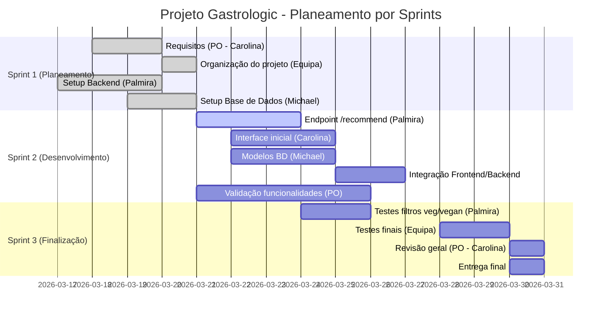

## 📊 Cronograma com Sprints

```mermaid
gantt
    title Projeto Gastrologic - Planeamento por Sprints
    dateFormat  YYYY-MM-DD

    section Sprint 1 (Planeamento)
    Requisitos (PO - Carolina)           :done, 2026-03-18, 2d
    Organização do projeto (Equipa)      :done, 2026-03-20, 1d
    Setup Backend (Palmira)              :done, 2026-03-17, 3d
    Setup Base de Dados (Michael)        :done, 2026-03-19, 2d

    section Sprint 2 (Desenvolvimento)
    Endpoint /recommend (Palmira)        :active, 2026-03-21, 3d
    Interface inicial (Carolina)         :2026-03-22, 3d
    Modelos BD (Michael)                 :2026-03-22, 3d
    Integração Frontend/Backend          :2026-03-25, 2d
    Validação funcionalidades (PO)       :2026-03-21, 5d

    section Sprint 3 (Finalização)
    Testes filtros veg/vegan (Palmira)   :2026-03-24, 2d
    Testes finais (Equipa)               :2026-03-28, 2d
    Revisão geral (PO - Carolina)        :2026-03-30, 1d
    Entrega final                        :2026-03-30, 1d
```
